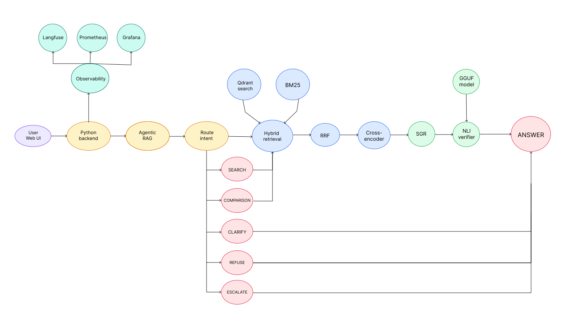
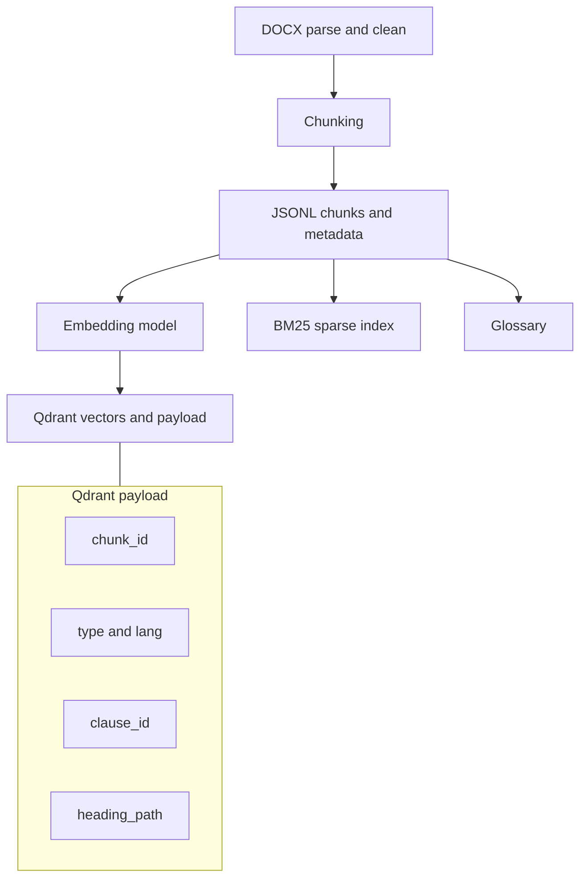

## 1. Контекст проекта

### 1.1 Бизнес-задача

- **Бизнес-цель:** Целью внедрения данного проекта является снижение нагрузки на поддержку НИУ ВШЭ в пиковые сезоны (сессии, пересдачи, восстановления, а также поступление). Типовые запросы значительно повышают время ответа, что увеличивает размер очереди. А также представленные источники информации требуют самостоятельного изучения, что также затрудняет сам процесс. В сессию и период пересдач суммарно приходит около 15.000 сообщений поддержке, на каждое из которых необходимо ответить. Поэтому разработка чат-бота который будет отвечать на основе единого документа, актуальна как способ снизить нагрузку на поддержку, а также повысить скорость получения необходимой информации.

- **Почему станет лучше, чем сейчас, от использования ML:** RAG чат-бот при генерации ответа опирается на документ, в нашем случае "Попаткус", с приложением цитирования на фрагмент, как подтверждение корректности ответа, тем самым снижая вероятность галлюцинаций. Это значительно ускоряет генерацию ответов на типовые вопросы пользователей и повышает доступность. Также, при возможном обновлении исходного документа "Попаткус", система выполняет переиндексацию базы, текст повторно разбивается на фрагменты, для каждого фрагмента пересчитываются эмбеддинги и обновляются записи в векторном хранилище, что гарантирует актуальность и минимизирует вероятность выдачи устаревшей информации.

- **Что будем считать успехом с точки зрения бизнеса:** Успехом считается снижение времени получения ответа на типовые вопросы и уменьшение доли ответов без подтверждения источником. Основными показателями являются доля ответов с цитатами на релевантные фрагменты документа, доля корректных отказов или эскалаций при отсутствии подтверждения, среднее время ответа и p95 latency. Дополнительно оценивается стабильность работы системы: количество ошибок, количество заблокированных потенциальных галлюцинаций и доля запросов, обработанных без необходимости ручного обращения к поддержке.

### 1.2 Целевая аудитория и пользователи

- **Кто будет пользоваться ботом:** Чат-ботом будут пользоваться студенты и абитуриенты НИУ ВШЭ.

- **Сценарии использования:** Пользователь взаимодействует с системой через веб-интерфейс: вводит вопрос в текстовом поле и получает ответ с цитатами на релевантные фрагменты документа. Веб-интерфейс используется для демонстрации работы RAG-пайплайна и тестирования разных сценариев запросов. В дальнейшем возможно добавление Telegram-бота или веб-виджета для сайта.

- **Предполагаемая нагрузка:** В пиковые сезоны - период сессий, пересдач, восстановления и приемной кампании, ожидается наибольшая нагрузка на систему. В эти периоды возрастет доля типовых запросов, для которых требуется быстрый и точный ответ с ссылкой на фрагменты документа.

### 1.3 Ограничения и допущения

- **Что система не будет делать:** Система не выражает персональную оценку по вопросам непосредственно связанных с обучением, если в базе знаний не представлены подходящие фрагменты, система сообщает об этом и предлагает обратиться в поддержку.  
  Также система не будет отвечать на вопросы вне тематики обучения. И система не будет давать ответы которые нельзя найти в Попаткусе. При возникновении спорных вопросов будет рекомендовать обратиться в поддержку.

- **Допущения о данных:** Единственный источник знаний - это документ "Попаткус", представленный в двух версиях на русском и английском языках (DOCX). Он разделен на разделы и доступен для парсинга. Также при обновлении документа происходит переиндексация базы, что гарантирует актуальность.

- **Допущения об инфраструктуре:** Система разворачивается на виртуальной машине. Qdrant используется как векторное хранилище, а локальная GGUF-модель через `llama.cpp` — для генерации ответов без обращения к внешним API. Инфраструктурные компоненты Qdrant, Prometheus и Grafana запускаются в Docker-контейнерах. Основной интерфейс реализован как веб-интерфейс; в дальнейшем возможно расширение до Telegram-бота или веб-виджета.

- **Допущения о нормативах:** Ответы должны быть обоснованы на источнике, иначе отказ или рекомендация обратиться в поддержку. При недостатке фрагментов, система не додумывает. Также обязателен запрет на ненормативную лексику, оскорбления и персональную оценку.

## 2. Архитектура решения

### 2.1 Общая схема

- **Диаграмма архитектуры:** User -> Web UI -> Python backend -> Agentic RAG -> Retrieval (Qdrant dense + BM25) -> RRF -> cross-encoder rerank -> SGR generation через локальную GGUF-модель -> проверка цитат / selective NLI verifier -> ответ с цитатами -> Web UI.  
 Qdrant используется как векторное хранилище, BM25 хранится как локальный sparse index. Метаданные чанков и тексты документа хранятся в подготовленных JSONL-файлах и payload Qdrant. Для мониторинга подключены Langfuse, Prometheus и Grafana.
  

  

- **Основные компоненты и их роли:**

  **Web UI:** пользовательский интерфейс, через который пользователь отправляет вопрос и получает ответ с цитатами.

  **Python backend:** серверная часть системы, которая принимает HTTP-запросы от веб-интерфейса и запускает RAG-пайплайн.

  **Agentic RAG:** модуль маршрутизации запросов. Определяет тип запроса: обычный поиск, сравнение, уточнение, отказ или эскалация.

  **Retrieval:** модуль поиска релевантных фрагментов документа. Использует dense retrieval через Qdrant и sparse retrieval через BM25.

  **Qdrant:** векторное хранилище, в котором хранятся эмбеддинги фрагментов документа и payload с метаданными: `chunk_id`, `type`, `lang`, `clause_id`, `heading_path`.

  **BM25 index:** локальный sparse index для поиска по точным терминам, аббревиатурам и формулировкам из документа.

  **RRF:** модуль объединения результатов dense и sparse retrieval.

  **Cross-encoder reranker:** модель повторного ранжирования найденных фрагментов, которая выбирает наиболее релевантный контекст для генерации.

  **SGR generation:** модуль структурированной генерации ответа. Локальная GGUF-модель через `llama.cpp` возвращает JSON с полями `answer`, `citations`, `found`.

  **Glossary fallback:** быстрый путь для вопросов на определение термина. Если термин найден в глоссарии, ответ возвращается без вызова LLM.

  **Citation validation / selective NLI verifier:** модуль пост-проверки. Проверяет наличие цитат; NLI вызывается выборочно, если ответ не содержит цитат и требуется дополнительная проверка.

  **Langfuse:** инструмент трейсинга отдельных запросов и отладки маршрутов Agentic RAG.

  **Prometheus и Grafana:** инструменты агрегированного мониторинга: количество запросов, latency, активные запросы, RAM и блокировки потенциальных галлюцинаций.

### 2.2 Хранилище знаний / документооборот

- **Источники знаний:**  
  Основной источник знаний — регламент внутренних правил НИУ ВШЭ "Попаткус". В текущей реализации система работает с подготовленной версией документа, которая парсится, разбивается на фрагменты и индексируется для последующего поиска. Дополнительные внешние справочники контактов и образовательных программ в текущую базу знаний не включались, в спорных или персональных случаях система рекомендует пользователю обратиться в поддержку.
- **Где храним и в каком виде:**  
  Исходный документ, подготовленные фрагменты и датасеты хранятся в репозитории проекта. После парсинга документ сохраняется в виде JSONL-файлов с текстами чанков и метаданными: `chunk_id`, `type`, `lang`, `clause_id`, `heading_path`.

  Qdrant используется для хранения эмбеддингов и payload чанков, необходимых для dense retrieval и цитирования. BM25 хранится как локальный sparse index и используется для поиска по точным терминам и аббревиатурам.

- **Пайплайн обновления:**
  Загружаем новую версию документов в формате DOCX (обновление происходит редко и вручную, по факту выхода новой редакции документа). Затем парсим документ - извлекаем структуру (заголовки, пункты, списки, таблицы, примечания) и очищаем текст от мусора (колонтитулы и номера страниц). Затем производим чанкинг (350–450 токенов, поскольку в Попаткусе пункты разные по размеру, overlap 60–80), таблицы индексируем отдельно (одна строка = один чанк), глоссарий - отдельно (один термин = один чанк), так как один и тот же тремин может быть сформулирован по разному (ИУП = индивидуальный учебный план). Повторно считаем эмбеддинги и обновляем индексы (dense в Qdrant + sparse BM25). Обновляем индекс (version) и при ошибках делаем безопасный откат на прошлую версию.
- **Как часто обновляем:**
  Так как сам документ обновляется редко, то подойдет ручная проверка документа на сайте раз в 90 дней, в последующем происходит весь пайплайн обновления.

### 2.3 Retrieval + Generation

- **Retrieval**  
  Основной поиск реализован как гибридный retrieval, объединяющий dense retrieval и sparse retrieval. Dense поиск выполняется в Qdrant по эмбеддингам фрагментов документа. Для эмбеддингов используется модель `intfloat/multilingual-e5-base`, так как она поддерживает русский и английский языки и показала хорошие результаты на golden set. Sparse поиск реализован через BM25 и используется для точных совпадений, терминов и аббревиатур. Результаты dense и sparse retrieval объединяются с помощью RRF, после чего применяется cross-encoder для повторного ранжирования найденных фрагментов. В финальной конфигурации retrieval возвращает наиболее релевантные фрагменты, которые затем передаются в генерацию.

- **Generation**  
  Генерация ответа выполняется локальной LLM-моделью в формате GGUF через `llama.cpp`. Для контроля формата ответа используется SGR. Модель возвращает структурированный JSON с полями `answer`, `citations` и `found`. Поле `answer` содержит итоговый ответ, `citations` содержит список идентификаторов фрагментов документа, а `found` показывает, было ли найдено подтверждение в контексте. Для вопросов на определение термина дополнительно реализован быстрый fallback по глоссарию. Если термин найден в глоссарии, ответ возвращается без вызова LLM.

- **Контроль ответа**  
  Контроль ответа строится на нескольких механизмах. Во-первых, SGR требует от модели возвращать цитаты на фрагменты документа. Во-вторых, проверяется наличие цитат и их соответствие найденному контексту. В-третьих, используется selective NLI verifier. Он запускается не для каждого ответа, а только в спорных случаях, например если ответ не содержит цитат. Если цитаты отсутствуют и simple NLI классифицирует ответ как `contradiction`, запрос отправляется в эскалацию. Если подтверждение в документе не найдено, система не додумывает ответ и сообщает, что в документе нет прямого подтверждения.

### 2.4 Интеграции и интерфейсы

- **Внешние API и сервисы:**  
  Основной пользовательский интерфейс реализован как Web UI. Внешние LLM API не используются: генерация выполняется локально с помощью GGUF-модели через `llama.cpp`. Внутренние компоненты проекта включают RAG-пайплайн, Qdrant для векторного поиска, локальный BM25 index, а также инструменты мониторинга: Langfuse, Prometheus и Grafana. При спорных или персональных запросах система не выдает контакты автоматически, а выполняет эскалацию и рекомендует обратиться в поддержку.

- **Протоколы:**  
  Web UI взаимодействует с backend через HTTP API. Backend принимает пользовательский запрос, запускает Agentic RAG, выполняет retrieval, rerank, SGR-генерацию и возвращает структурированный ответ с цитатами. Prometheus забирает метрики backend через endpoint `/metrics`, а Grafana визуализирует эти метрики в виде дашборда.

- **UI/UX требования:**  
  Пользователь взаимодействует с системой через веб-интерфейс. Интерфейс должен содержать поле для ввода вопроса и область отображения ответа. Ответ формируется структурированно: краткое объяснение, цитаты на релевантные фрагменты документа и, при необходимости, расшифровка терминов из глоссария. Если подтверждение в документе не найдено или запрос требует персонального решения, система не додумывает ответ, а сообщает, что в документе нет прямого подтверждения, и рекомендует обратиться в поддержку.

- **Мониторинг:**  
  Для анализа работы системы используются Langfuse, Prometheus и Grafana. Langfuse сохраняет trace отдельных запросов: входной вопрос, выбранный intent, найденные фрагменты, результат генерации и задержку этапов. Prometheus собирает агрегированные метрики backend: количество запросов, статусы обработки, среднее время ответа, P95 latency, активные запросы, использование RAM и количество блокировок потенциальных галлюцинаций. Grafana визуализирует эти метрики в виде дашборда.

### 2.5 Инфраструктура и развертывание

- **Архитектурный стек**  
  Система разворачивается на виртуальной машине в Yandex Cloud. Серверная часть реализована на Python и запускает основной RAG-пайплайн. В Docker-контейнерах поднимаются инфраструктурные компоненты. Qdrant используется как векторная база данных, Prometheus собирает метрики работы системы, Grafana визуализирует их в виде дашбордов. BM25 хранится как локальный sparse index и загружается в память при запуске. Локальная LLM используется в формате GGUF через `llama.cpp`, веса модели хранятся отдельно от Docker-образов.

- **Среды**  
  Основная разработка и тестирование выполнялись на виртуальной машине. Для проверки качества используются заранее подготовленные наборы вопросов, включая golden set. На них измеряются метрики retrieval, качество цитирования, latency SGR, работа Agentic RAG и verifier. Разделение конфигураций выполняется через переменные окружения и отдельные конфиги для путей к моделям, Qdrant, Prometheus и Langfuse.

- **Требования к вычислениям**  
  Так как генерация выполняется локально через GGUF-модель на CPU, основная нагрузка приходится на LLM inference. Для демонстрационного запуска достаточно виртуальной машины с несколькими vCPU, 8-16 GB RAM и диском, достаточным для хранения индексов, данных и GGUF-моделей. Qdrant, Prometheus и Grafana имеют меньшие требования к ресурсам и запускаются в контейнерах. Retrieval и агентная логика занимают существенно меньше времени по сравнению с генерацией ответа.

- **Безопасность**  
  Секреты, ключи и токены не коммитятся в репозиторий и должны храниться в переменных окружения. Система не использует внешние LLM API, так как генерация выполняется локально. Пользовательские запросы обрабатываются через backend, а в мониторинг сохраняются технические метрики и traces, необходимые для отладки. Для снижения риска некорректных ответов используются SGR, проверка citation id, Agentic RAG и selective NLI verifier. При отсутствии подтверждения в документе система не додумывает ответ и отправляет запрос в эскалацию или возвращает безопасный отказ.

- **Масштабирование**  
  При росте нагрузки можно уменьшать число фрагментов, передаваемых в генерацию, ограничивать `top_k` для rerank, кешировать результаты retrieval для частых вопросов и выносить генерацию на более мощную машину. Так как основная задержка связана с локальной LLM, дальнейшее ускорение возможно за счет GPU инференса.

## 3. Данные и качество знаний

### 3.1 Сбор и предобработка данных

- **Источники**  
  Основной источник данных это документ "Попаткус". В текущей реализации система работает с подготовленной версией документа, которая парсится, разбивается на фрагменты и индексируется для поиска. Дополнительные справочники контактов и образовательных программ в текущую базу знаний не включались. При персональных или спорных вопросах система выполняет эскалацию и рекомендует обратиться в поддержку.

- **Шаги предобработки**

1. **Извлечение структуры из DOCX**  
   Из документа извлекаются заголовки, обычный текст, списки, таблицы, примечания и иерархия разделов. Для обработки DOCX используется библиотека python-docx, а примечания извлекаются отдельно из структуры docx-архива.

2. **Очистка текста**  
   Удаляются технические элементы документа, лишние переносы строк, номера страниц и другие фрагменты, которые не должны попадать в поиск и генерацию ответа.

3. **Разбиение на чанки**  
   Документ делится на фрагменты по логическим границам пунктов и подпунктов. Базовой единицей является пункт регламента или определение из глоссария. Для слишком длинных пунктов выполняется дополнительное разбиение с overlap, чтобы сохранить локальный контекст между соседними фрагментами. Таблицы и списки сохраняются как текстовые блоки внутри соответствующих пунктов.

4. **Выделение глоссария**  
   Термины из глоссария сохраняются как отдельный тип фрагментов. Это нужно для обработки аббревиатур и терминов, например ИУП или КУД. Для вопросов на определение термина используется быстрый глоссарный fallback. Если термин найден в глоссарии, система возвращает определение без вызова LLM.

Подготовленные фрагменты и их метаданные сохраняются в JSONL-файлах. Qdrant хранит эмбеддинги фрагментов и payload с основными метаданными, которые используются для retrieval и цитирования. BM25 хранится как локальный sparse index и загружается в память при запуске.

- **Метаданные**  
  Для каждого фрагмента сохраняются основные поля, необходимые для поиска и цитирования. К ним относятся `chunk_id`, `type`, `lang`, `clause_id`, `heading_path` и текст фрагмента. Поле `type` показывает тип фрагмента, например `rules`, `glossary`, `table` или `note`. Поле `clause_id` используется как человекочитаемый идентификатор цитаты, а `heading_path` сохраняет иерархию разделов.

### 3.2 Векторизация и индексирование

- **Какая модель была выбрана для embedding**  
  Так как основной документ содержит русскоязычные данные, а часть запросов может быть сформулирована на английском языке, для dense retrieval была выбрана модель `intfloat/multilingual-e5-base`. Модель поддерживает мультиязычный поиск и показала лучшие результаты среди протестированных embedding-моделей на golden set. Для семейства E5 используются префиксы `query` для пользовательского запроса и `passage` для фрагментов документа. Дополнительно используется BM25 как sparse retrieval, так как в документе встречаются точные термины и аббревиатуры, например ИУП и КУД.

- **Параметры индекса**  
  Векторное хранилище реализовано с помощью Qdrant. Для каждого чанка считается embedding размерности 768, поиск выполняется по cosine similarity. В payload Qdrant сохраняются основные метаданные фрагмента, включая `chunk_id`, `type`, `lang`, `clause_id` и `heading_path`. Dense retrieval используется вместе с BM25, после чего результаты объединяются с помощью RRF и дополнительно ранжируются cross-encoder моделью.

- **Стратегии обновления**  
  Документ "Попаткус" обновляется нечасто, поэтому основная стратегия обновления состоит в полной переиндексации при изменении исходного документа. При обновлении повторно выполняются парсинг, чанкинг, пересчет эмбеддингов, обновление Qdrant и пересборка BM25-индекса. Такой подход проще для поддержки и подходит для небольшого корпуса документов.

### 3.3 Метрики качества знаний

- **Покрытие**  
  Проверяется, что основные пункты документа попали в индекс и имеют корректные метаданные. Для каждого фрагмента должны быть сохранены `chunk_id`, `type`, `lang`, `clause_id` и `heading_path`. Также на "golden set" измеряется, попадает ли релевантный фрагмент в `top k` до и после rerank.

- **Актуальность**  
  Так как документ "Попаткус" обновляется нечасто, для обновления базы знаний используется полная переиндексация. После изменения исходного документа заново выполняются парсинг, чанкинг, пересчет эмбеддингов, обновление Qdrant и пересборка BM25-индекса.

- **Консистентность**  
  Проверяется, что у фрагментов нет пустых или некорректных метаданных, так как они используются для retrieval и цитирования. Особенно важны поля `clause_id` и `heading_path`, потому что по ним формируются ссылки на источник в ответе. Также проверяется, что глоссарные фрагменты имеют тип `glossary`, чтобы быстрый fallback для терминов работал корректно.

- **Проверка**  
  После изменений в чанкинге, retrieval, rerank или генерации прогоняется "golden set". Для оценки используются метрики retrieval, качество цитирования, latency и доля ответов с валидными citation id. Если метрики ухудшаются, изменение не считается успешным.

## 4. Модель и генерация

### 4.1 Выбор LLM и промптинг

- **Указание модели**  
  Для генерации ответов была выбрана локальная open-source LLM в формате GGUF, запускаемая через `llama.cpp`. Модель используется без внешних LLM API, что позволяет выполнять генерацию локально на сервере. В SGR-режиме модель должна возвращать структурированный JSON-ответ с полями `answer`, `citations` и `found`. При выборе модели учитывались качество ответа, наличие цитат, валидность citation id, parse success rate, средняя latency, P95 latency и требования к ресурсам.

  На первом этапе была протестирована модель `gemma3:4b` через Ollama, однако после добавления SGR и structured JSON latency на CPU стала слишком высокой. После этого были протестированы GGUF-конфигурации через `llama.cpp` с grammar-constrained decoding. В финальной конфигурации используется GGUF-модель, которая стабильно возвращает структурированный ответ с цитатами и укладывается в ограничения локального CPU inference.

- **Промпт-шаблоны**  
  Для генерации используется SGR-промпт. На вход модели передаются пользовательский вопрос, язык и найденные фрагменты документа. Каждый фрагмент содержит текст и идентификатор цитаты, например `clause_id`. Модель должна отвечать только на основе переданного контекста и возвращать структурированный ответ с полями `answer`, `citations` и `found`.
  Для повышения стабильности вывода используется grammar-constrained decoding. В отличие от обычного prompt-based JSON, где модель только получает инструкцию вернуть JSON, grammar-constrained decoding ограничивает допустимые токены во время генерации. Поэтому модель может генерировать только текст, соответствующий заданной JSON-грамматике.

  Поле `answer` содержит итоговый текст ответа пользователю. Поле `citations` содержит список идентификаторов фрагментов, на которые опирается ответ. Поле `found` показывает, было ли найдено подтверждение в контексте. Если подтверждение не найдено, система не должна додумывать ответ.

  Для вопросов на определение термина используется отдельный быстрый fallback по глоссарию. Если вопрос содержит формулировки вроде "что такое", "что означает" или "определение", и термин найден в глоссарии, система возвращает определение напрямую без вызова LLM.

  Для провокационных, запрещенных или не относящихся к документу запросов используется маршрут отказа в Agentic RAG. В этом случае генерация по документу не запускается, а пользователь получает безопасный отказ или рекомендацию обратиться в поддержку.

- **Ограничения**  
  Число фрагментов, передаваемых в генерацию, ограничивается, чтобы контролировать latency локальной LLM. Также ограничивается длина контекста и максимальное число генерируемых токенов. Для контроля качества ответа используются SGR, проверка цитат и selective NLI verifier. NLI запускается не для каждого ответа, а только в спорных случаях, например если ответ не содержит цитат.

### 4.2 Контроль качества ответов

- **Метрики**  
  Для оценки качества ответов используются метрики цитирования, корректности отказов, задержки и стабильности структурированного вывода.  
  `Citation coverage` показывает долю ответов, в которых есть хотя бы одна цитата на фрагмент документа.  
  `Valid citation rate` показывает долю цитат, которые совпадают с `clause_id` найденных фрагментов или относятся к глоссарию.  
  `Gold citation hit rate` показывает, процитировала ли модель релевантный фрагмент из golden set.  
  `Latency` измеряется для retrieval, генерации, полного пайплайна и отдельных стадий Agentic RAG. Для задержки считаются mean, P50, P95, P99, min и max.

- **Механизмы обработки**  
  Контроль качества строится на нескольких уровнях. Сначала Agentic RAG определяет тип запроса и выбирает маршрут обработки. Провокационные или нерелевантные запросы не передаются в генерацию, а обрабатываются через маршрут отказа или эскалации.

  После retrieval найденные фрагменты проходят rerank, чтобы в генерацию попал наиболее релевантный контекст. Генерация выполняется через SGR. Модель возвращает структурированный JSON с полями `answer`, `citations` и `found`, а grammar-constrained decoding снижает риск невалидного формата.

  После генерации проверяется наличие цитат и их соответствие найденным фрагментам. Если ответ содержит валидные цитаты, он считается подтвержденным источником. Если цитаты отсутствуют, может запускаться selective NLI verifier. В runtime используется мягкая логика проверки. Эскалация выполняется только если у ответа нет цитат и simple NLI возвращает класс `contradiction`.

  Если подтверждение в документе не найдено, система не додумывает ответ и сообщает, что в документе нет прямого подтверждения. Для вопросов на определение термина используется быстрый fallback по глоссарию, который возвращает определение без вызова LLM.

### 4.3 Обучение и дообучение

Дообучение модели в текущей версии не используется. Основная идея проекта состоит не в изменении весов LLM, а в построении качественного RAG-пайплайна. Для контроля ответов используются retrieval, rerank, SGR, grammar-constrained decoding, проверка citation id и selective NLI verifier.

Такой подход выбран потому, что модель должна отвечать строго по документу "Попаткус". Поэтому важнее правильно найти релевантный фрагмент и проверить цитаты, чем дообучать модель на небольшом доменном наборе. Дообучение можно рассматривать как направление дальнейшей работы, если после улучшения retrieval и контроля цитат останется значимая доля некорректных ответов.

## 5. UX / пользовательский опыт

### 5.1 Сценарии взаимодействия

- **Основные сценарии**  
  Пользователь взаимодействует с системой через веб-интерфейс. Он вводит вопрос в текстовое поле, после чего backend запускает Agentic RAG, определяет тип запроса, выполняет retrieval, rerank и генерацию ответа. В обычном сценарии система возвращает краткий ответ с цитатами на релевантные фрагменты документа. Если в вопросе встречаются термины из глоссария, система может дополнительно вернуть их расшифровку.

  Для вопросов на определение термина используется быстрый глоссарный fallback. Если пользователь спрашивает "что такое", "что означает" или "определение", и термин найден в глоссарии, ответ возвращается без вызова LLM. Это снижает latency и уменьшает риск ошибки генерации.

  Для сравнительных вопросов Agentic RAG определяет сущности сравнения, отдельно ищет релевантные фрагменты для каждой сущности и формирует ответ с объяснением различий. Если вопрос сформулирован неоднозначно, система может вернуть уточнение или выполнить эскалацию.

- **Исключительные сценарии**  
  Если подтверждение в документе не найдено, система не додумывает ответ и сообщает, что в документе нет прямого подтверждения. Если запрос является провокационным, связан с мошенничеством, списыванием или обходом правил, Agentic RAG выбирает маршрут отказа, и генерация по документу не запускается.

  Если ответ не содержит цитат, может запускаться selective NLI verifier. Если simple NLI определяет противоречие между ответом и найденным контекстом, запрос отправляется в эскалацию. В спорных или персональных случаях система рекомендует обратиться в поддержку.

### 5.2 Диалоговая логика

- **Как обрабатываются запросы**  
  В текущей реализации система работает в основном в single-turn режиме. Пользователь отправляет вопрос через веб-интерфейс, после чего backend запускает Agentic RAG, определяет маршрут обработки и возвращает ответ.

  Логика обработки задается маршрутизацией внутри Agentic RAG. Возможные маршруты включают обычный поиск, сравнительный запрос, уточнение, отказ и эскалацию. Для обычного вопроса выполняются retrieval, rerank, SGR generation и проверка цитат. Для провокационного запроса выбирается маршрут отказа. Для неоднозначного или спорного запроса система может выполнить эскалацию.

- **Как ведется контекст**  
  Диалоговая память в текущей версии минимальная. Каждый вопрос обрабатывается как самостоятельный запрос. Внутри одного запроса сохраняются служебные данные Agentic RAG, включая исходный вопрос, выбранный intent, найденные фрагменты, результат генерации, цитаты и причину эскалации, если она возникла.

  Такой подход упрощает систему и снижает риск переноса нерелевантного контекста между разными вопросами. Если пользователь хочет уточнить вопрос, он отправляет новую формулировку, после чего retrieval и генерация выполняются заново.

- **Как выглядят ответы**  
  Ответы формируются в уважительном и нейтральном тоне, без эмоциональных оценок, оскорблений и ненормативной лексики. В обычном сценарии пользователь получает краткое объяснение и цитаты на фрагменты документа. Если в ответе используются термины из глоссария, система может дополнительно вернуть их расшифровку.

  Если подтверждение в документе не найдено, система не додумывает ответ и сообщает, что в документе нет прямого подтверждения. Для провокационных или нерелевантных запросов возвращается безопасный отказ или рекомендация обратиться в поддержку.

### 5.3 Метрики UX

- **Метрики пользовательского опыта**  
  Для оценки пользовательского опыта фиксируется задержка ответа системы. Основными метриками являются среднее время ответа, P50, P95 и P99 latency полного пайплайна. Также отдельно анализируются задержки retrieval, генерации ответа и агентной логики, чтобы понимать вклад каждого этапа в итоговое время ожидания.

  Дополнительно отслеживаются количество запросов, количество ошибок, доля заблокированных или эскалированных запросов и количество активных запросов. Эти метрики собираются через Prometheus и визуализируются в Grafana. Для анализа отдельных проблемных запросов используется Langfuse, где можно посмотреть маршрут обработки, найденные фрагменты, ответ модели и latency этапов.

  Пользовательская оценка ответа в текущей версии не реализована. Ее можно добавить в дальнейшем как отдельный механизм обратной связи.

## 6. Безопасность, соответствие и этика

- **Персональные данные и права пользователей**  
  Система ориентирована на справочные ответы по документу "Попаткус" и не требует ввода персональных данных. Пользовательские запросы обрабатываются через веб-интерфейс, а для анализа работы системы сохраняются только технические данные, необходимые для отладки и мониторинга. К ним относятся текст запроса, результат маршрутизации, найденные фрагменты, ответ модели, latency этапов и статус обработки.

- **Фильтры и безопасная обработка запросов**  
  Система не должна отвечать на запросы, связанные с мошенничеством, списыванием, обходом правил, оскорблениями или темами вне области документа. Такие запросы обрабатываются через маршрут отказа или эскалации в Agentic RAG. Если подтверждение в документе не найдено, система не додумывает ответ и сообщает, что в документе нет прямого подтверждения.

- **Контроль корректности ответов**  
  Для снижения риска галлюцинаций используются SGR, обязательные цитаты, проверка citation id и selective NLI verifier. Ответ считается более надежным, если он содержит цитаты на найденные фрагменты документа. Если цитаты отсутствуют и simple NLI определяет противоречие между ответом и контекстом, запрос отправляется в эскалацию.

- **Секреты и доступы**  
  Секреты, ключи доступа и токены не коммитятся в репозиторий и должны храниться в переменных окружения. Локальная LLM запускается на сервере через `llama.cpp`, поэтому пользовательские запросы не отправляются во внешние LLM API. Инфраструктурные компоненты, такие как Qdrant, Prometheus и Grafana, запускаются на сервере проекта.

- **Мониторинг и логи**  
  Для анализа отдельных запросов используется Langfuse, а для агрегированных метрик используются Prometheus и Grafana. В мониторинг попадают технические показатели работы системы, включая количество запросов, latency, ошибки, активные запросы, использование RAM и блокировки потенциальных галлюцинаций. Такой подход позволяет отслеживать стабильность системы без хранения лишних пользовательских данных.

## 7. Риски и допущения

- **Список основных рисков**
  - **Риск 1**  
    Главный риск системы связан с галлюцинациями LLM. Если retrieval нашел нерелевантные фрагменты или контекст оказался недостаточным, модель может сгенерировать ответ, который не подтверждается документом. Для снижения риска используются SGR, обязательные цитаты, проверка citation id, Agentic RAG и selective NLI verifier. Если подтверждение в документе не найдено, система не додумывает ответ и возвращает безопасный отказ или эскалацию.

  - **Риск 2**  
    База знаний ограничена документом "Попаткус". Поэтому часть вопросов может относиться к информации, которой нет в документе. Например, персональные ситуации, внутренние решения учебного офиса или актуальные контакты поддержки. В таких случаях система не должна придумывать ответ и рекомендует обратиться в поддержку.

  - **Риск 3**  
    Ошибки при парсинге DOCX могут ухудшить качество retrieval и корректность цитирования. Например, могут некорректно извлечься таблицы, списки, примечания или номера пунктов. Для снижения риска сохраняются метаданные `clause_id` и `heading_path`, а после изменений в парсинге и чанкинге прогоняется "golden set".

  - **Риск 4**  
    Русская и английская версии документа могут отличаться по формулировкам или актуальности. В таком случае ответ на английский запрос может опираться на фрагмент, который не полностью совпадает с русской версией. Для снижения риска retrieval выполняется с учетом языка запроса, а в ответе используются цитаты из той версии документа, по которой был найден контекст.

  - **Риск 5**  
    Локальная генерация через GGUF-модель на CPU может быть медленной. Это особенно заметно при длинном контексте, SGR и grammar-constrained decoding. Для контроля latency ограничивается длина контекста, число передаваемых фрагментов и максимальное число генерируемых токенов. Также для глоссарных вопросов используется быстрый fallback без вызова LLM.

  - **Риск 6**  
    Agentic RAG может ошибиться в маршрутизации запроса. Например, обычный вопрос может быть ошибочно отправлен в отказ или эскалацию, а провокационный вопрос может пройти дальше в retrieval. Для снижения риска используются отдельные правила и классификация intent, а маршруты запросов анализируются через Langfuse.

  - **Риск 7**  
    Автоматический verifier может давать ложные срабатывания. NLI-модель не является абсолютной оценкой корректности ответа, поэтому в runtime она используется только как дополнительный сигнал риска. Эскалация выполняется только если у ответа нет цитат и simple NLI возвращает `contradiction`.

  - **Риск 8**  
    При росте нагрузки может увеличиться задержка ответа. Основной вклад в latency вносит генерация локальной LLM, тогда как retrieval и агентная логика занимают существенно меньше времени. Для снижения риска можно уменьшать число фрагментов в контексте, использовать более легкую GGUF-модель, кешировать частые запросы или выносить генерацию на более мощную машину.

- **Непроверенные допущения**
  - Предполагается, что русская и английская версии документа "Попаткус" содержательно согласованы. Если пользователь задает вопрос на английском языке, система использует английские фрагменты документа и формирует ответ на английском языке.

  - Предполагается, что документ "Попаткус" содержит достаточно информации для ответа на большую часть типовых вопросов пользователей.

  - Предполагается, что `clause_id` и `heading_path` корректно извлекаются из документа и могут использоваться для цитирования.

  - Предполагается, что выбранная GGUF-модель и текущая конфигурация `llama.cpp` подходят для демонстрационного CPU inference.

  - Предполагается, что быстрый глоссарный fallback покрывает основные вопросы на определение терминов.

  - Предполагается, что при росте нагрузки основным узким местом будет генерация ответа, а не retrieval или агентная логика.

## 10. Приложения

- **Словарь терминов и аббревиатур**

  Попаткус - Положение об организации промежуточной аттестации и текущего контроля успеваемости студентов.

  НИУ ВШЭ - Национальный исследовательский университет "Высшая школа экономики".

  RAG - Retrieval Augmented Generation. Подход, при котором языковая модель генерирует ответ не только на основе своих внутренних знаний, но и на основе найденных внешних документов.

  Dense retrieval - семантический поиск по эмбеддингам фрагментов документа.

  Sparse retrieval - лексический поиск по точным совпадениям. В проекте используется BM25.

  RRF - Reciprocal Rank Fusion. Метод объединения результатов разных retrieval-модулей.

  CRAG - Corrective RAG. Подход, при котором система оценивает качество найденного контекста и при необходимости запускает дополнительную обработку или безопасный отказ.

  Agentic RAG - расширение RAG-пайплайна, в котором агент выбирает маршрут обработки запроса. Например обычный поиск, сравнение, отказ, уточнение или эскалация.

  SGR - Schema Guided Reasoning. Подход к генерации, при котором модель возвращает ответ в заданной структуре. В проекте используется JSON с полями `answer`, `citations` и `found`.

  GGUF - формат хранения локальных LLM-моделей, используемый вместе с `llama.cpp`.

  NLI - Natural Language Inference. Метод проверки отношения между контекстом и утверждением. В проекте используется как дополнительный verifier.

  Citation id - идентификатор фрагмента документа, который модель возвращает в поле `citations`. В проекте для этого используется `clause_id` или ссылка на глоссарий.

- **Дополнительные материалы**

  Актуальная схема архитектуры хранится в репозитории в файле `assets/architecture.svg`.

  Подготовленные наборы вопросов и результаты экспериментов находятся в директории `opt/rag/data`.

  Конфигурации мониторинга находятся в файлах `docker-compose.monitoring.yml` и `prometheus.yml`.
